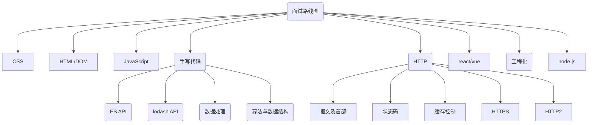

import { Cards, Card } from 'nextra/components'
import { FaInfo } from 'react-icons/fa6'

# 面试路线图

如果你**目前正在准备前端面试**，则强烈按照 [面试路线图](/roadmap) 的路线准备。它是从题库 [Daily-Question](https://github.com/shfshanyue/Daily-Question) 中精选出的**高频**前端面试题，且从浅入深。

而在全部题库中，有些题库过偏，且顺序随意，忽难忽易，适合面试准备完毕后随机抽选题目测试自己，或者用以面试官作为题库面试候选人。

面试路线图如下：

